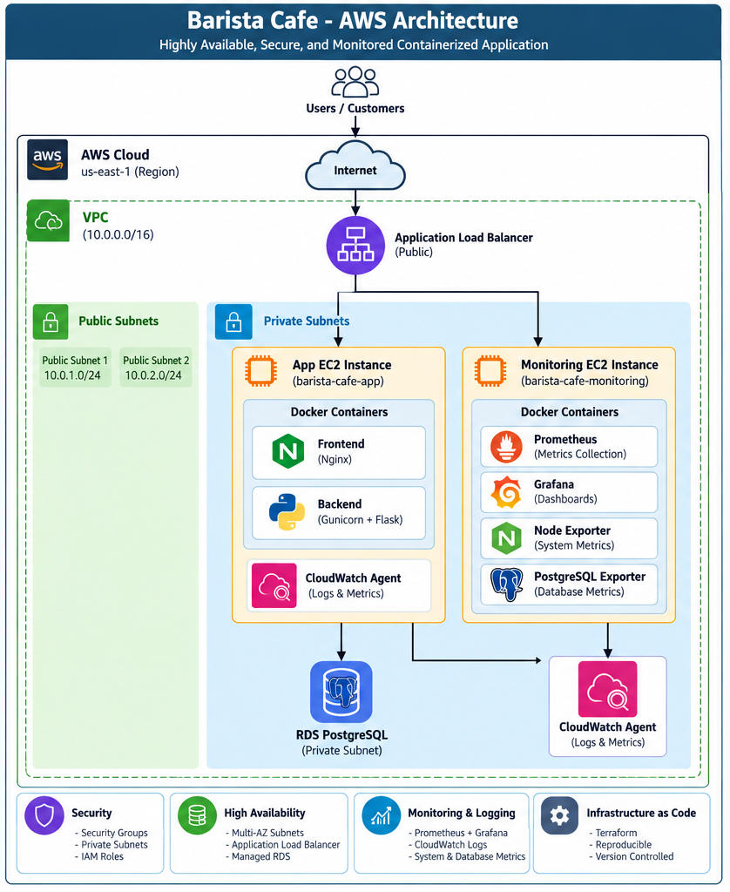
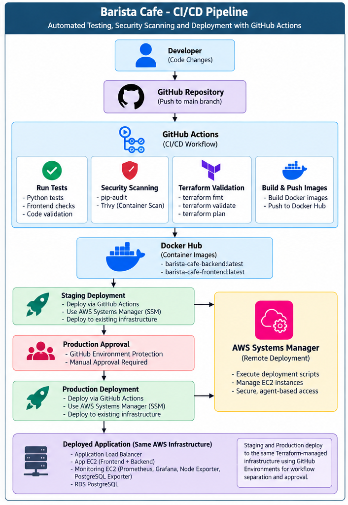

# Barista Cafe DevOps Platform
[](../../actions/workflows/ci-cd.yml)


A complete DevOps implementation for a containerized Barista Cafe application, covering AWS infrastructure provisioning, Docker containerization, GitHub Actions CI/CD, security scanning, controlled deployment, monitoring, centralized logging, and secret management.

This project was developed as an end-to-end DevOps assignment with an emphasis on reproducibility, automation, observability, security, and cost-conscious infrastructure.

---

## Architecture

### AWS Architecture



### CI/CD Architecture



---

## Project Overview

The platform uses:

- Terraform for AWS infrastructure as code
- Docker for application packaging
- GitHub Actions for CI/CD
- Docker Hub for container images
- AWS Systems Manager for remote deployment
- Amazon RDS PostgreSQL for persistence
- Application Load Balancer for frontend access
- Prometheus and Grafana for monitoring
- Node Exporter and PostgreSQL Exporter for infrastructure/database metrics
- Amazon CloudWatch for centralized logging
- GitHub Secrets and protected environments for secret management and deployment control

---

## Technology Stack

| Area | Technology |
|---|---|
| Frontend | HTML/CSS/JavaScript, Nginx |
| Backend | Python, Flask/Gunicorn |
| Database | PostgreSQL 17 on Amazon RDS |
| Containers | Docker, Docker Compose |
| Infrastructure | Terraform |
| Cloud | AWS |
| Load Balancing | Application Load Balancer |
| Remote Deployment | AWS Systems Manager |
| CI/CD | GitHub Actions |
| Container Registry | Docker Hub |
| Dependency Scanning | pip-audit |
| Container Scanning | Trivy |
| Metrics | Prometheus |
| Dashboards | Grafana |
| Host Metrics | Node Exporter |
| Database Metrics | PostgreSQL Exporter |
| Logging | Amazon CloudWatch Logs |

---

## AWS Infrastructure

Terraform provisions:

- VPC `10.0.0.0/16`
- Two public subnets across Availability Zones
- Two private subnets across Availability Zones
- Internet Gateway and route tables
- Application Load Balancer
- Application EC2 instance
- Monitoring EC2 instance
- RDS PostgreSQL
- Security groups
- IAM roles and instance profiles
- CloudWatch Agent bootstrap configuration
- S3 remote Terraform backend

### Traffic flow

```text
Users
  |
  v
Internet
  |
  v
Application Load Balancer
  |
  v
Application EC2
  |
  +---- Frontend container
  |
  +---- Backend container
           |
           v
     RDS PostgreSQL
```

The application and database tiers are not directly exposed as public application endpoints.

---

## Repository Structure

```text
barista-cafe-devops-platform/
├── .github/
│   └── workflows/
│       └── ci-cd.yml
│
├── backend/
│   ├── tests/
│   ├── app.py
│   ├── requirements.txt
│   └── Dockerfile
│
├── frontend/
│   ├── Dockerfile
│   └── ...
│
├── deployment/
│   ├── app/
│   │   ├── deploy-app.sh
│   │   ├── docker-compose.yml
│   │   └── barista-cloudwatch-agent.json
│   └── monitoring/
│       ├── deploy-monitoring.sh
│       ├── docker-compose.yml
│       ├── prometheus.yml
│       └── grafana/
│
├── terraform/
│   ├── backend.tf
│   ├── variables.tf
│   ├── outputs.tf
│   ├── providers.tf
│   ├── vpc.tf
│   ├── security-groups.tf
│   ├── ec2.tf
│   ├── alb.tf
│   ├── rds.tf
│   └── ...
│
├── docs/
│   ├── architecture/
│   │   ├── aws-architecture.png
│   │   └── cicd-architecture.png
│   ├── screenshots/
│   │   ├── 01-application-deployed.png
│   │   ├── 02-cicd-pipeline-success.png
│   │   ├── 03-production-manual-approval.png
│   │   ├── 04-slack-failure-notification.png
│   │   ├── 05-grafana-application-metrics.png
│   │   └── 06-cloudwatch-docker-logs.png
│   ├── approach.md
│   └── challenges.md
│
├── docker-compose.yml
├── .gitignore
└── README.md
```

---

# Application

The application contains:

- A frontend served through Nginx
- A Python backend API
- PostgreSQL persistence

Contact and reservation requests are stored in PostgreSQL.

The deployed application is accessed through the AWS Application Load Balancer.

## Application Evidence


---

# Containerization

The application is packaged as two Docker images:

```text
josephmj0303/barista-cafe-backend
josephmj0303/barista-cafe-frontend
```

The deployment uses Docker Compose on EC2.

The monitoring host separately runs:

```text
Prometheus
Grafana
Node Exporter
PostgreSQL Exporter
```

---

# Terraform

Terraform is the source of truth for AWS infrastructure.

## Initialize

```bash
cd terraform
terraform init
```

## Format and validate

```bash
terraform fmt -recursive
terraform validate
```

## Review the plan

```bash
terraform plan
```

## Apply

```bash
terraform apply
```

## View outputs

```bash
terraform output
```

## Destroy when no longer required

```bash
terraform destroy
```

The infrastructure was tested using a complete destroy/recreate lifecycle to verify reproducibility.

---

# Terraform State Management

Terraform state is stored remotely in an encrypted S3 backend.

The repository does not commit:

```text
terraform.tfstate
terraform.tfstate.*
terraform.tfvars
*.tfplan
```

The S3 backend provides shared state storage for local operations and GitHub Actions.

---

# CI/CD Pipeline

GitHub Actions implements the complete CI/CD workflow.

## Pull Requests

Pull requests targeting `main` execute validation and security checks.

The pipeline includes:

- PostgreSQL service container
- Pytest unit/integration tests
- Dependency vulnerability scanning with `pip-audit`
- Python syntax validation
- Docker Compose validation
- Backend Docker build
- Frontend Docker build
- Trivy container scanning
- Terraform formatting validation
- Terraform validation

No AWS deployment occurs from the pull-request validation path.

## Main Branch

A successful push to `main` continues through:

```text
Test & Security Scan
        |
        +---- Terraform Validation
        |
        v
Build & Push Docker Images
        |
        v
Deploy Staging
        |
        v
Manual Production Approval
        |
        v
Deploy Production
```

Docker images are pushed to Docker Hub with:

```text
latest
<git-sha>
```

### CI/CD Evidence


---

# Staging and Production

GitHub Environments are used for:

```text
staging
production
```

The staging environment performs the pre-production deployment.

The production environment is protected by a required reviewer, creating a manual approval gate before the production deployment job can continue.


### Important architecture note

This assignment uses one Terraform-managed AWS infrastructure environment. The staging and production distinction is implemented in the GitHub Actions workflow and protected environments rather than by maintaining two separate AWS stacks.

This keeps the assignment architecture small and cost-conscious while demonstrating controlled promotion to production.

---

# Deployment Automation

Deployment is performed through AWS Systems Manager rather than SSH.

The main deployment scripts are:

```text
deployment/app/deploy-app.sh
deployment/monitoring/deploy-monitoring.sh
```

They:

1. Resolve required infrastructure values.
2. Receive secrets from GitHub Actions.
3. Prepare deployment configuration.
4. Configure CloudWatch Agent.
5. Validate Docker Compose configuration.
6. Pull container images.
7. Start the application/monitoring stack.
8. Wait for the SSM command to complete.
9. Return failure status when deployment fails.

The deployment scripts use fail-fast shell behavior so remote failures propagate to the CI/CD workflow.

---

# Monitoring and Observability

Monitoring is implemented with Prometheus and Grafana.

## Application Metrics

The backend exposes application metrics for:

- Request rate
- HTTP status
- Request latency
- Total requests
- HTTP 5xx error rate


## Infrastructure and Database Metrics

The monitoring stack collects:

- CPU usage
- Memory usage
- Disk I/O
- PostgreSQL availability
- PostgreSQL connections
- Database transaction activity
- Additional PostgreSQL exporter metrics

Two meaningful Grafana dashboards are provided:

1. **Barista Cafe - Application Metrics**
2. **Barista Cafe - Infrastructure and Database**

---

# Centralized Logging

Amazon CloudWatch Logs provides centralized logging for the environment.

The logging configuration covers:

- System logs
- Application/container logs
- Frontend/Nginx access logs

Representative log groups include:

```text
/barista/system
/barista/docker
```


Logs can be reviewed centrally without requiring direct SSH access to the application host.

---

# Security

Security controls implemented in the project include:

- Private subnets for application, monitoring and database resources
- RDS configured without public access
- Security groups controlling tier-to-tier traffic
- IAM roles for EC2 access to AWS services
- AWS Systems Manager instead of SSH-based deployment
- GitHub Secrets for CI/CD credentials
- Protected GitHub production environment
- Database password excluded from Terraform outputs
- Local Terraform variable files excluded from Git
- Encrypted S3 Terraform state
- Container and dependency vulnerability scanning

---

# Secret Management

The assignment requires at least one of secret management or backup strategy.

This project implements secret management.

Sensitive values are provided through GitHub Secrets, including:

```text
AWS_ACCESS_KEY_ID
AWS_SECRET_ACCESS_KEY
DB_PASSWORD
DOCKERHUB_USERNAME
DOCKERHUB_TOKEN
SLACK_WEBHOOK_URL
```

The local `terraform.tfvars` file is ignored by Git and is not part of the repository.

Deployed `.env` files are created on the EC2 host with restricted permissions.

No actual credentials are stored in the repository.

---

# Cost Optimization

The infrastructure is intentionally sized for an assignment/demo workload.

Cost-conscious decisions include:

- Small EC2 instance classes
- Small RDS instance class
- Minimal RDS storage
- Lightweight monitoring stack
- Docker Hub used as the image registry
- Avoiding unnecessary managed services
- Ability to destroy the entire environment when not required
- Reproducible recreation instead of maintaining unused infrastructure

The environment is not intended to represent production-scale capacity.

---

# Infrastructure Reproducibility

A fresh infrastructure lifecycle was tested:

```text
terraform destroy
        |
        v
terraform init
        |
        v
terraform apply
        |
        v
Fresh EC2 + ALB + RDS
        |
        v
GitHub Actions deployment
        |
        v
Application + Monitoring
```

This validated that the application and monitoring deployments do not depend on undocumented manual changes remaining on previous EC2 instances.

---

# Failure Notification

The CI/CD workflow includes a failure notification job that sends a Slack notification when an upstream pipeline job fails.

The notification includes:

- Repository
- Branch
- Workflow
- Run number
- Commit SHA


The failure path was deliberately tested and the temporary test modification was reverted from the final workflow.

---

# Validation and Evidence

The project was validated through:

- Terraform initialization and validation
- Terraform outputs/state inspection
- Fresh infrastructure recreation
- EC2 health checks
- ALB target health checks
- RDS availability
- Application accessibility through the ALB
- Application database persistence
- Successful GitHub Actions pipeline
- Production manual approval
- Docker image publishing
- Prometheus metrics
- Grafana dashboards
- CloudWatch log groups and streams
- Slack failure notification

Additional evidence is available under:

```text
docs/screenshots/
```

---

# Documentation

Additional assignment documentation:

- [Approach Documentation](docs/approach.md)
- [Challenges and Resolutions](docs/challenges.md)

These documents explain the architecture decisions, implementation approach, troubleshooting process, and lessons learned during the assignment.

---

# Key DevOps Practices Demonstrated

- Infrastructure as Code
- Remote Terraform state
- Reproducible infrastructure
- Containerization
- CI/CD automation
- Pull-request validation
- Dependency scanning
- Container vulnerability scanning
- Controlled production deployment
- AWS Systems Manager deployment
- Infrastructure monitoring
- Application observability
- Database monitoring
- Centralized logging
- Secret management
- Failure notification
- Cost-conscious architecture
- Documentation and operational troubleshooting

---

# Assignment Coverage

| Assignment Requirement | Implementation |
|---|---|
| VPC with public/private subnets | Terraform |
| EC2 application hosting | Application EC2 |
| PostgreSQL RDS | Amazon RDS |
| Security groups | Terraform |
| Frontend load balancer | Application Load Balancer |
| Configurable variables | `terraform/variables.tf` |
| State management | Encrypted S3 backend |
| Key outputs | `terraform/outputs.tf` |
| Tests on PR | GitHub Actions |
| Docker build/push | Docker Hub |
| Staging deployment | GitHub `staging` environment |
| Production approval | Protected `production` environment |
| Unit/integration tests | Pytest + PostgreSQL service |
| Dependency scanning | pip-audit |
| Container scanning | Trivy |
| Failure notification | Slack |
| CPU/memory/disk metrics | Node Exporter + Grafana |
| Application metrics | Backend `/metrics` + Prometheus/Grafana |
| Database metrics | PostgreSQL Exporter |
| Application logs | CloudWatch |
| System logs | CloudWatch |
| Access logs | CloudWatch |
| Two meaningful dashboards | Grafana |
| Setup documentation | README |
| Architecture decisions | README + approach |
| Security considerations | README |
| Cost optimization | README |
| Secret management | GitHub Secrets + protected environments |
| Approach documentation | `docs/approach.md` |
| Challenges/resolutions | `docs/challenges.md` |

---

# Project Status

The assignment implementation is complete and has been validated end-to-end.

The repository contains:

- Terraform infrastructure
- Containerized application
- GitHub Actions CI/CD
- Production approval
- Vulnerability scanning
- Slack failure notification
- Prometheus/Grafana monitoring
- CloudWatch centralized logging
- Secret management
- Architecture diagrams
- Screenshots/evidence
- Approach documentation
- Challenges and resolutions
